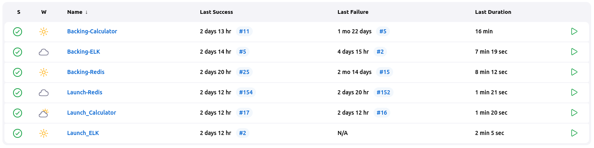
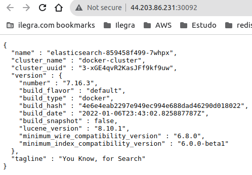
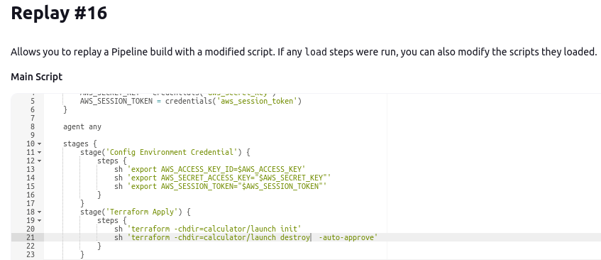

# Tema final
The objective of this theme is run two calculator ec2 instances with redis database cluster (configured with one main instance and one replica instance), sending the calculator metrics to the stack ELK (in other ec2 instance). For now the only part working in stack ELK instance is the elasticsearch.

Backed with packer and launched with terraform. All through Jenkins jobs.

## Required
- Jenkins
- AWS credentials

## Configuring 

### AWS
Create a security group with the following Inbound rules and replace the value in every launch/variables.tf and launch/module/nlb/variables.tf file

- 6379
- 8000
- 30092

### Jenkins

#### AWS Credentials

Go to **Dashboard** -> **Manage Jenkins** -> **Manage Credentials** -> **Global Credentials**
   - Create a **secret text** named **aws_access_key** and paste your **AWS Access Key ID**
   - Create a **secret text** named **aws_secret_key** and paste your **AWS Secret Access Key**
   - Create a **secret text** named **aws_session_token** and paste your **AWS Session Token**

#### Environment Variables

Go to **Dashboard** -> **Manage Jenkins** -> **System** -> **Global properties**
1. Enable Environment variables
2. Add a var named **AWS_REGION** with value **us-east-1**
3. Add a var named **PASS_MAIN** with a passowrd for redis main instance
    > suggested: passM4in!
4. Add a var named **PASS_REPLICA** with a passowrd for redis replica instance
    > suggested: passR3plica!
5. Save


#### Creating jobs

Go to **Dashboard** -> **New Item** -> **Pipeline** and name it as in [Names and Script Paths](####Names-and-Script-Paths)

##### Pipeline config:
- **Definition**: Pipeline script from SCM
- **SCM**: Git
- **Repository URL**: https://github.com/Gabriely-get/tema-final-ilegra.git
- **Branch Specifier:** */main
- **Script Path**: as in [Names and Script Paths](####Names-and-Script-Paths)

##### Names and Script Paths
- Redis 
    - pipeline name: Backing_Redis
    - script path: redis/backing/Jenkinsfile

    - pipeline name: Launch_Redis
    - script path: redis/launch/Jenkinsfile
- Calculator 
    - pipeline name: Backing_Calculator
    - script path: calculator/backing/Jenkinsfile

    - pipeline name: Launch_Calculator
    - script path: calculator/launch/Jenkinsfile
- ELK 
    - pipeline name: Backing_ELK
    - script path: elk/backing/Jenkinsfile

    - pipeline name: Launch_ELK
    - script path: elk/launch/Jenkinsfile

## Running

Order to execute the jobs.

1. Backing_Redis
2. Launch_Redis
3. Backing_Calculator
4. Launch_Calculator
5. Backing_ELK
6. Launch_ELK

<br/>

 

## Endpoints

To access the endpoints, copy the public ip of the EC2 instance.

### Calculator

Endpoints and examples of appropriate response

</br>

Addition: { public_ip }:8000/calc/sum/{value1}/{value2}

``` json
{
    "result": "10"
}
``` 

Subtraction: { public_ip }:8000/calc/sub/{value1}/{value2}
``` json
{
    "result": "5"
}
``` 
Division: { public_ip }:8000/calc/div/{value1}/{value2}
``` json
{
    "result": "7"
}
``` 
Multiplication: { public_ip }:8000/calc/mult/{value1}/{value2}
``` json
{
    "result": "30"
}
``` 
Historic: { public_ip }:8000/calc/historic
``` json
[
    {
        "time": "2022-08-19T02:13:52.853500749-03:00",
        "result": "6.00 - 6.00 = 0.00",
        "operation": "SUBTRACTION"
    },
    {
        "time": "2022-08-19T02:13:52.859714718-03:00",
        "result": "6.00 + 6.00 = 12.00",
        "operation": "ADDITION"
    }
]
``` 
### Elasticsearch EC2 ELK

elasticsearch: { public_ip }:30092
<br/>

 

## Destroying

For destroy the infrastructure, go to the desired Launch, in the last build click on replay and replace the word **apply** for **destroy** in Terraform Apply stage

Like that:


 